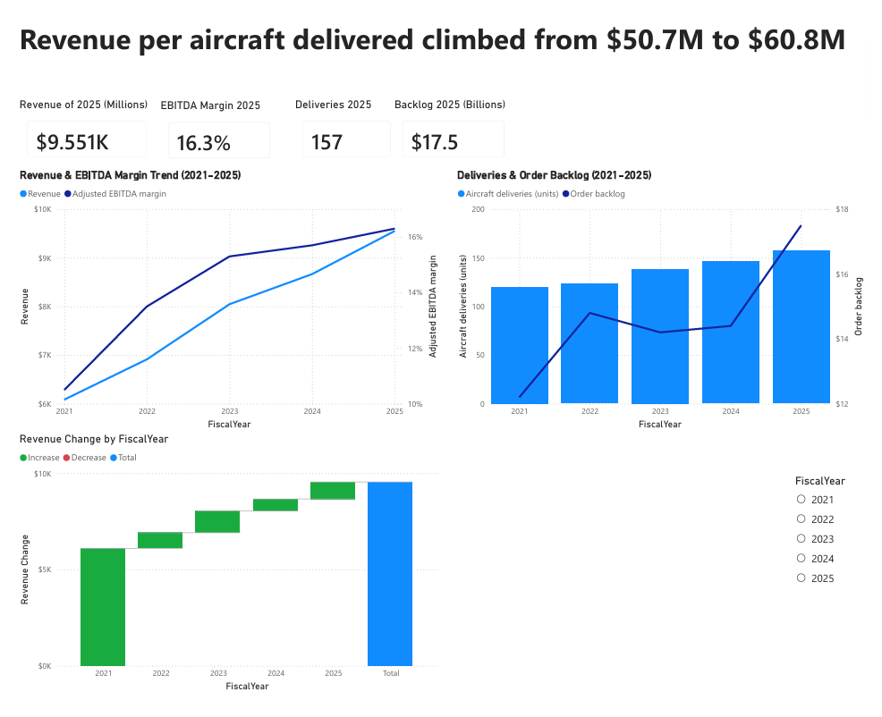
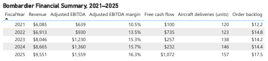

# Bombardier Financial Performance Analysis (2021–2025)

An end-to-end analysis of Bombardier Inc.'s public financial performance, built as a portfolio project for the Finance/Business Analyst Rotation Program (Dorval, QC). The project follows a real analyst workflow: **source real data → structure it in SQL → visualize it in Power BI → communicate findings in a written memo.**

This is an independent analysis using Bombardier's publicly disclosed financial data. It is not affiliated with or endorsed by Bombardier Inc.

## Dashboard preview


*KPI cards, revenue/margin trend, and deliveries/backlog trend — FY2021–FY2025*


*Full 5-year raw figures for verification against the source report*

## Why this project

Rather than using a generic public dataset, this project analyzes the company I'm applying to, using its own audited financial disclosures. The goal was to demonstrate the full workflow of a rotational analyst — not just building a dashboard, but sourcing, validating, modeling, and interpreting real numbers the way the role actually requires.

## Project files

| File | Description |
|---|---|
| `bombardier_finance.db` | SQLite database — source of truth for all figures |
| `bombardier_finance.csv` | Flat export of the same data |
| `sample_queries.sql` | Annotated analytical SQL queries |
| `Bombardier_Finance_Project.pbix` | Power BI report (2 pages: Dashboard, Data Table) |
| `Bombardier_Insights_Memo.docx` | One-page written findings memo |
| `dashboard.png` / `table.png` | Dashboard screenshots (shown above) |

## Data source

All figures are sourced directly from Bombardier's own **2025 Annual Financial Report** (published February 2026), specifically:
- Five-Year Summary table (pp. 13–14) — Revenue, Adjusted EBITDA, Adjusted EBITDA Margin, Free Cash Flow
- Aircraft Deliveries and Order Backlog disclosure (p. 36)

No data was estimated, generated, or pulled from third-party aggregators. Every figure can be traced back to the source document. All values reflect continuing operations.

## Tech stack

- **SQLite** (via DB Browser for SQLite) — data storage and analytical queries
- **Power BI Desktop** — dashboard and DAX measures
- **Excel** — manual data entry and validation against source PDF
- **Word** — final insights memo

## What's in the SQL layer

`sample_queries.sql` includes 6 annotated queries covering:
- Year-over-year revenue growth (using `LAG()` window functions)
- Adjusted EBITDA margin trend
- Revenue per aircraft delivered (a derived pricing/mix metric)
- 3-year compound annual growth rate (CAGR)
- Backlog coverage ratio (years of revenue currently booked)
- Multi-metric year-over-year change in a single query

## What's in the Power BI dashboard

**Page 1 — Dashboard:**
- 4 KPI cards (FY2025 Revenue, Adj. EBITDA Margin, Aircraft Deliveries, Order Backlog)
- Revenue & Adjusted EBITDA Margin trend (dual-axis line chart, 2021–2025)
- Deliveries & Order Backlog (combo bar/line chart, dual-axis)
- Revenue growth waterfall (2021→2025), built on a custom DAX measure

**Page 2 — Data Table:**
Full 5-year raw figures for verification against the source report.

**Key DAX measure:**
```dax
Revenue Change = 
VAR CurrentRevenue = bombardier_finance[Revenue]
VAR PrevRevenue = LOOKUPVALUE(
    bombardier_finance[Revenue], 
    bombardier_finance[FiscalYear], 
    bombardier_finance[FiscalYear] - 1
)
RETURN IF(ISBLANK(PrevRevenue), CurrentRevenue, CurrentRevenue - PrevRevenue)
```
Calculates year-over-year revenue change to drive the waterfall chart, since the raw table stores cumulative yearly totals rather than deltas.

## Key findings

- **Pricing/mix improvement, not just volume growth:** revenue per aircraft delivered rose from $50.7M (2021) to $60.8M (2025).
- **Margin expansion outpaced revenue growth:** Adjusted EBITDA margin grew from 10.5% to 16.3% over the period, while revenue grew from $6.1B to $9.6B.
- **Backlog cooled briefly, then surged:** order backlog dipped from $14.8B (2022) to $14.2B (2023) before climbing 23% to $17.5B in 2025.
- **On track against forward guidance:** FY2025 revenue of $9,551M sits just under Bombardier's own stated FY2026 guidance of >$10.0B.

Full write-up in [`Bombardier_Insights_Memo.docx`](./Bombardier_Insights_Memo.docx).

## A data quality issue I found and fixed

While validating the SQL layer, a year-over-year calculation was silently returning `NULL`/`0` for every row. Diagnosis traced the issue to the CSV import: currency-formatted Excel cells (e.g. `"$6,085.00"`) had been imported as **text**, not numeric values — SQLite's flexible typing allowed this without throwing an error. Fixed by stripping formatting characters and casting the affected columns to `REAL`:

```sql
UPDATE bombardier_finance
SET Revenue = CAST(REPLACE(REPLACE(Revenue, '$', ''), ',', '') AS REAL);
-- (repeated for Adjusted EBITDA, Free cash flow, Order backlog)
```

Documenting this because it's a realistic example of the kind of data quality issue that shows up in real analyst work — the fix mattered more than avoiding the bug entirely.

## Skills demonstrated

SQL (window functions, subqueries, data validation/debugging) · Power BI (DAX, dual-axis visuals, data modeling) · Financial statement literacy (EBITDA, margin, backlog, FCF) · Data sourcing and citation discipline · Written business communication

## Author

Coco — BSc Mathematics and Statistics. originally built while preparing for Bombardier's Finance/Business Analyst Rotation Program, demonstrating SQL, Power BI, and financial analysis skills applicable to corporate finance and business analyst roles broadly.
